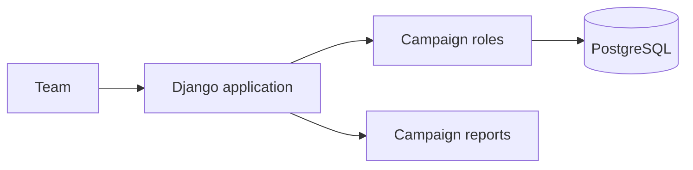

# Portfolio overview

## Architecture

## Core flow

1. A team member creates a campaign and receives only its permitted scope.
2. Contacts and interactions are associated with that campaign.
3. Reports use campaign filters so one campaign cannot read another's records.

## Environment and data

Use the documented environment file and local database instructions in deploy.md. Demo fixtures are synthetic; they do not represent voters, real contacts, or political operations.

## Decisions

- Campaign isolation is more important than broad read access.
- Permissions are modeled explicitly rather than inferred from the UI.
- Reports are generated from scoped records, not client-supplied identifiers.
